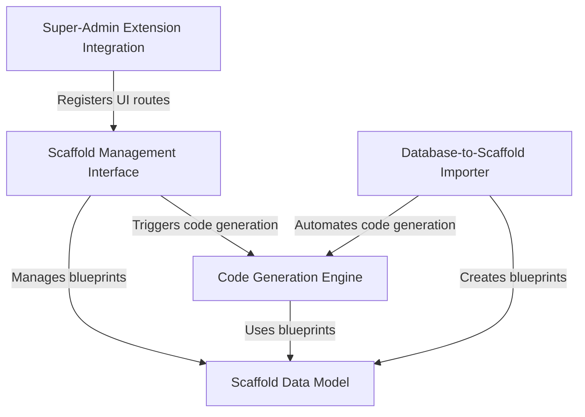
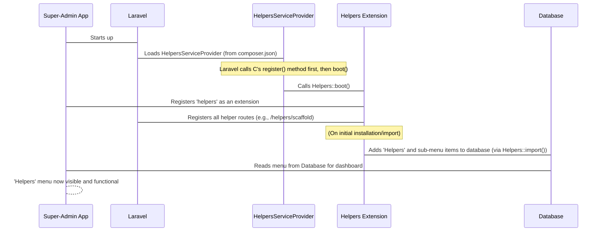
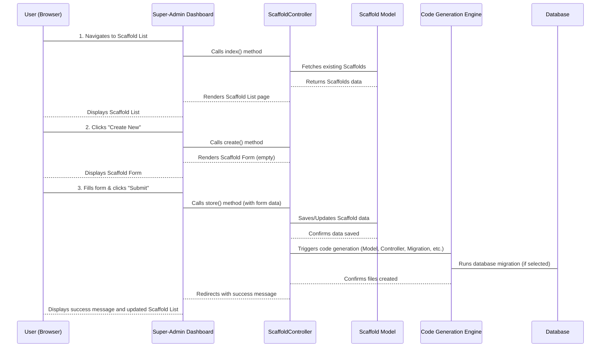
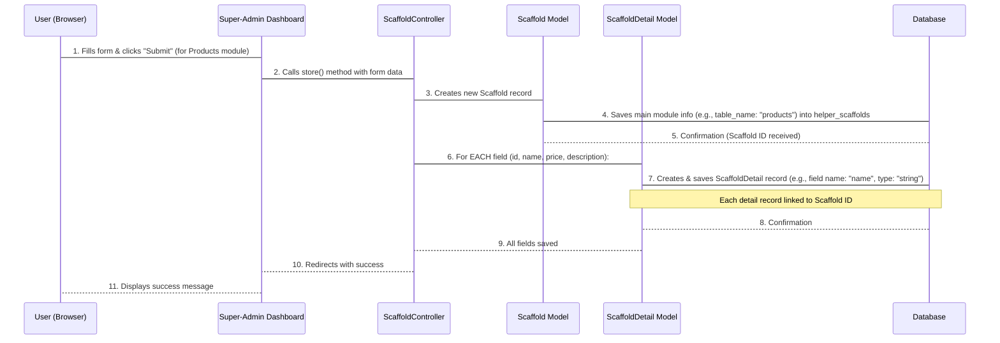
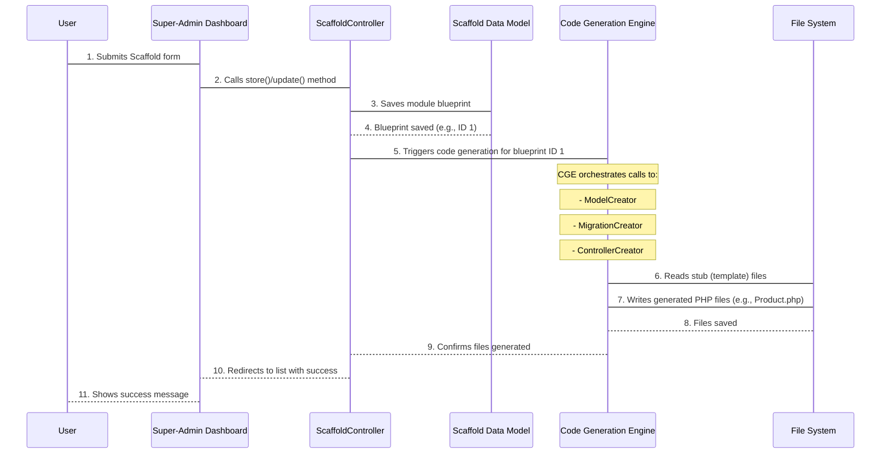
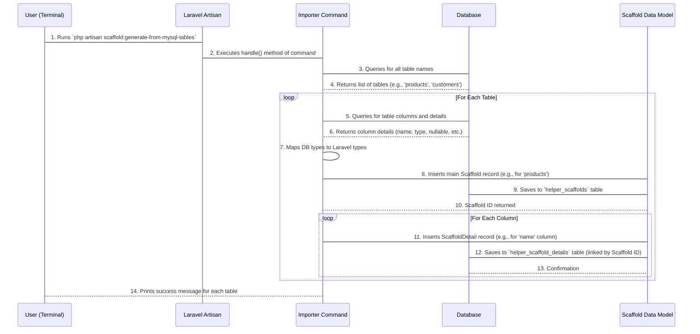

# Tutorial: helpers

This project, `helpers`, acts as a powerful *scaffolding tool* for Laravel applications, specifically designed to **automate the creation of CRUD (Create, Read, Update, Delete) modules**. It allows users to *define module blueprints* through a user-friendly interface, then **generates all necessary code files** like models, controllers, and migrations, and can even *import existing database tables* to streamline development within the Super-Admin dashboard.


## Visual Overview



## Chapters

1. [Super-Admin Extension Integration
](01_super_admin_extension_integration_.md)
2. [Scaffold Management Interface
](02_scaffold_management_interface_.md)
3. [Scaffold Data Model
](03_scaffold_data_model_.md)
4. [Code Generation Engine
](04_code_generation_engine_.md)
5. [Database-to-Scaffold Importer
](05_database_to_scaffold_importer_.md)

---

<sub><sup>Generated by [AI Codebase Knowledge Builder](https://github.com/The-Pocket/Tutorial-Codebase-Knowledge).</sup></sub>


# Chapter 1: Super-Admin Extension Integration

Imagine you've just bought a brand new printer. It's a fantastic piece of technology, but it won't do anything unless you **plug it into your computer** and your computer **knows how to talk to it**.

Our `helpers` project is a bit like that new printer. It's a powerful tool with lots of features, but to use them within the `Super-Admin` dashboard, we need to make sure `Super-Admin` (our computer) knows it exists and how to access its features.

This chapter is all about how `helpers` "plugs in" and becomes visible and functional inside the `Super-Admin` framework. It's the crucial first step to getting everything else to work!

---

### Making the Connection: The Core Idea

The main challenge this "Super-Admin Extension Integration" solves is: **How do we tell the `Super-Admin` system about our `helpers` extension so its tools appear in the dashboard and actually do something when we click them?**

For example, our goal is to see a "Helpers" menu item in the Super-Admin dashboard, and when we click it, we should find options like "Scaffold," "Database terminal," and "Laravel artisan" ready to use. This integration process makes that possible.

Let's break down how this connection is made.

### Key Concepts

Two main components work together to make this integration happen:

1.  **The Service Provider (`HelpersServiceProvider`)**: Think of this as the main "switch" that tells Laravel (the foundation of Super-Admin) about our `helpers` extension. It's the first thing Laravel looks at when starting up your application. It says, "Hey, I have some special code here that needs to be loaded!"
2.  **The Extension Class (`Helpers`)**: This is the "brain" of our extension. Once the Service Provider tells Laravel to load it, this class takes over. It's responsible for:
    *   Registering all the different web addresses (called "routes") that our `helpers` tools will use.
    *   Adding new menu items to the `Super-Admin` dashboard, so you can easily find and click on our features.

Let's look at how these pieces are configured.

### The `composer.json` File: Your Extension's ID Card

When you install `helpers`, the `composer.json` file plays a small but vital role. This file is like a list of instructions for your project. Inside it, there's a special section that tells Laravel which "Service Providers" to load.

Here's the relevant part:

```json
{
    "extra": {
        "laravel": {
            "providers": [
                "SuperAdmin\\Admin\\Helpers\\HelpersServiceProvider"
            ]
        }
    }
}
```

**What's happening here?**

*   `"laravel": { "providers": [...] }` is a standard way Laravel applications find out about new components.
*   `"SuperAdmin\\Admin\\Helpers\\HelpersServiceProvider"` is the full name of our "Service Provider" class.
*   This entry acts like a big sign that says, "Laravel, please make sure you load and run the `HelpersServiceProvider` when you start up!"

### The Service Provider: The Initial Setup

The `HelpersServiceProvider` is the first part of our `helpers` extension that Laravel loads. It's like the initial power-up sequence for our "printer."

```php
// File: src/HelpersServiceProvider.php
<?php

namespace SuperAdmin\Admin\Helpers;

use Illuminate\Support\ServiceProvider;

class HelpersServiceProvider extends ServiceProvider
{
    // ... other code ...

    /**
     * This method runs when Laravel starts up.
     */
    public function boot()
    {
        // Tells Laravel where our database changes (migrations) are.
        $this->loadMigrationsFrom(__DIR__ . '/../database/migrations');
        // Tells Laravel where our visual pages (views) are.
        $this->loadViewsFrom(__DIR__ . '/../resources/views', 'super-admin-helpers');

        // This is the crucial line: it activates our Helpers Extension!
        Helpers::boot();
    }

    /**
     * This method runs before 'boot' and is for registering things.
     */
    public function register()
    {
        // Registers various command-line tools for our helpers.
        $this->commands($this->commands);
    }
}
```

**What's happening here?**

*   The `boot()` method is automatically called by Laravel when your application starts.
*   `$this->loadMigrationsFrom(...)` and `loadViewsFrom(...)` tell Laravel where to find important files for the `helpers` extension, like database changes or design templates.
*   The most important line for integration is `Helpers::boot();`. This line **activates** our main `Helpers` class, which then handles registering routes and menus.
*   The `register()` method is for setting up things *before* everything is fully loaded. Here, it registers some command-line tools that come with `helpers`.

### The `Helpers` Class: Defining Features and Menus

Once the `HelpersServiceProvider` calls `Helpers::boot()`, our `Helpers` class takes over. This class is where we tell `Super-Admin` *what* our extension does and *how* users can access it.

```php
// File: src/Helpers.php
<?php

namespace SuperAdmin\Admin\Helpers;

use SuperAdmin\Admin\Admin; // Used to extend Super-Admin
use SuperAdmin\Admin\Auth\Database\Menu; // Used to add menu items
use SuperAdmin\Admin\Extension; // Our base class

class Helpers extends Extension
{
    /**
     * This method is called by the Service Provider.
     */
    public static function boot()
    {
        // 1. Tell Super-Admin about our web addresses (routes).
        static::registerRoutes();

        // 2. Tell Super-Admin that 'helpers' is an active extension.
        Admin::extend('helpers', __CLASS__);
    }

    /**
     * This method defines all the web addresses for our features.
     */
    public static function registerRoutes()
    {
        parent::routes(function ($router) {
            /* @var \Illuminate\Routing\Router $router */
            // Example: Connects the web address '/helpers/scaffold'
            // to the ScaffoldController's 'index' method.
            $router->get('helpers/scaffold', 'SuperAdmin\\Admin\\Helpers\\Controllers\\ScaffoldController@index')->name('scaffold.index');
            // ... many more routes for other features ...
            $router->get('helpers/terminal/database', 'SuperAdmin\\Admin\\Helpers\\Controllers\\TerminalController@database');
        });
    }

    /**
     * This method is run separately (e.g., during installation)
     * to add menu items to the Super-Admin dashboard.
     */
    public static function import()
    {
        // Find the last order to place our new menu items correctly.
        $lastOrder = Menu::max('order');

        // Create the main "Helpers" menu item.
        $root = [
            'parent_id' => 0, // This makes it a top-level menu item
            'order'     => $lastOrder++,
            'title'     => 'Helpers',
            'icon'      => 'icon-cogs', // An icon for the menu
            'uri'       => '', // No direct link, it's a parent
        ];
        $root = Menu::create($root); // Save it to the database

        // Define the sub-menu items under "Helpers"
        $menus = [
            [
                'title'     => 'Scaffold',
                'icon'      => 'icon-keyboard',
                'uri'       => 'helpers/scaffold', // Links to our scaffold page
            ],
            // ... other menu items like 'Database terminal', 'Laravel artisan' ...
        ];

        // Add each sub-menu item to the database.
        foreach ($menus as $menu) {
            $menu['parent_id'] = $root->id; // Link to the "Helpers" parent
            $menu['order'] = $lastOrder++;
            Menu::create($menu);
        }

        // Also creates a permission to control who can access these helpers.
        parent::createPermission('Admin helpers', 'ext.helpers', 'helpers/*');
    }
}
```

**What's happening here?**

*   **`boot()` Method**: This is the entry point.
    *   `static::registerRoutes();`: Calls another method to define all the web addresses that `helpers` features will use. For example, when you go to `/admin/helpers/scaffold` in your browser, this route ensures `Super-Admin` knows to show the scaffolding forms.
    *   `Admin::extend('helpers', __CLASS__);`: This line formally tells `Super-Admin` that `helpers` is an installed extension and points to this `Helpers` class as its main definition.
*   **`registerRoutes()` Method**: This method maps friendly web addresses (like `helpers/scaffold`) to specific pieces of code (like `ScaffoldController@index`). It's like telling your computer that "print document" command actually runs a specific program on your printer.
*   **`import()` Method**: This method is usually run once after installation. Its job is to create the actual menu items in the `Super-Admin` dashboard. It adds a "Helpers" main menu, and then sub-items like "Scaffold," "Database terminal," etc., linking them to the routes we just registered. These menu items are stored in `Super-Admin`'s database.

### The Integration Flow: Step-by-Step

Let's visualize how these pieces connect when `Super-Admin` starts up or when the extension is installed:



1.  **Application Starts**: When your Super-Admin application begins, `Laravel` (its core framework) kicks into action.
2.  **Service Provider Loaded**: `Laravel` checks `composer.json` and finds the `HelpersServiceProvider`. It then loads and initializes this provider.
3.  **`HelpersServiceProvider` Boots**: The `boot()` method of `HelpersServiceProvider` is called. Inside, it runs `Helpers::boot()`.
4.  **`Helpers` Extension Activates**: The `Helpers::boot()` method does two main things:
    *   It registers all the web routes (`helpers/scaffold`, `helpers/terminal/database`, etc.) with Laravel, so the Super-Admin system knows which code to run when these URLs are visited.
    *   It tells the `Super-Admin` system that `helpers` is an active extension, linking it to the `Helpers` class.
5.  **Menu Items Created (on Install)**: Separately, when you first install or enable the `helpers` extension, the `Helpers::import()` method is run. This method directly adds entries into `Super-Admin`'s database for the "Helpers" menu and its sub-items. This is how they actually appear in the dashboard navigation.
6.  **Ready to Use**: With routes registered and menu items in the database, the `helpers` extension is now fully integrated. When a user logs into `Super-Admin`, they'll see "Helpers" in the menu, and clicking on its items will correctly load the powerful tools provided by the `helpers` project!

---

### Conclusion

In this chapter, we learned how the `helpers` project seamlessly integrates with the `Super-Admin` framework. We saw how `composer.json` points to the `HelpersServiceProvider`, which then boots the `Helpers` class. This `Helpers` class is then responsible for registering all the necessary web routes and creating the menu items that make `helpers` features accessible directly within the `Super-Admin` dashboard.

This integration is the foundation upon which all other features of `helpers` are built. Now that `helpers` is plugged in and visible, we can start exploring its core functionalities.

Next, we'll dive into one of the most powerful features enabled by this integration: the [Scaffold Management Interface](02_scaffold_management_interface_.md), which allows you to quickly generate forms and lists for your database tables.

---

<sub><sup>Generated by [AI Codebase Knowledge Builder](https://github.com/The-Pocket/Tutorial-Codebase-Knowledge).</sup></sub> <sub><sup>**References**: [[1]](https://github.com/super-admin-org/helpers/blob/315e47d3aa789f7311d3ea72bc17db6b973c57c2/composer.json), [[2]](https://github.com/super-admin-org/helpers/blob/315e47d3aa789f7311d3ea72bc17db6b973c57c2/src/Helpers.php), [[3]](https://github.com/super-admin-org/helpers/blob/315e47d3aa789f7311d3ea72bc17db6b973c57c2/src/HelpersServiceProvider.php)</sup></sub>

# Chapter 2: Scaffold Management Interface

In the previous chapter, [Super-Admin Extension Integration](01_super_admin_extension_integration_.md), we learned how the `helpers` project "plugs into" your Super-Admin dashboard, making its powerful tools accessible. Think of it like connecting a fancy new control panel to your main computer.

Now that the connection is made, what can we do with it? This chapter introduces you to the **Scaffold Management Interface** – the main "control panel" of the `helpers` project within Super-Admin.

## What is the Scaffold Management Interface?

Imagine you're building a house. You need blueprints, lists of materials, and instructions for each room. Doing all that by hand for every single room would be a huge task!

In web development, when you want to add a new "feature" or "module" (like a "Products" section for your e-commerce site, or a "Blog Posts" section), you often need to create several files:
*   A **database table** to store the data (e.g., `products` table).
*   A **Model** file to interact with that table (e.g., `Product.php`).
*   A **Controller** file to handle requests (e.g., `ProductController.php`).
*   **Views** (web pages) to display and manage the data.
*   And sometimes even API controllers, tests, and more!

Manually creating all these files for every new feature is tedious and prone to errors. This is the problem the **Scaffold Management Interface** solves!

It's a user-friendly dashboard within Super-Admin that lets you **define what you want to build** (like telling your house builder: "I need a kitchen with these exact features"). Once you define it, the system automatically **generates all the necessary code files** for you. It's like having an automatic blueprint and instruction generator!

**Our Goal for this Chapter:** Understand how to use this interface to quickly create a new module, for example, a `Products` module for an e-commerce site.

## Key Concepts

Let's break down the main ideas behind this interface:

1.  **The Control Panel (The Form)**: This is a web form where you tell `helpers` about your new module. You'll specify details like the name of your database table, the fields it should have (e.g., product name, price), and what kind of files you want `helpers` to generate (model, controller, migration, etc.).
2.  **The Module List (The Table)**: After you create modules, this part of the interface shows you a list of all the modules you've already generated. You can see their names, quickly search through them, and easily edit or delete them.
3.  **The Code Generation Workflow**: When you fill out the form and click "Submit", the Scaffold Management Interface doesn't just save your settings; it triggers a powerful process that automatically writes the actual code files (like PHP files for models and controllers, and SQL for migrations) based on your input.

## How to Use the Scaffold Management Interface: Creating a `Products` Module

Let's walk through creating a simple `Products` module.

### Step 1: Accessing the Interface

First, log into your Super-Admin dashboard. In the left-hand menu, under "Helpers", you'll see "Scaffold".

*   Click on **Helpers**.
*   Click on **Scaffold**.

This will take you to the "Scaffold List" page. To create a new module, you'll click the "Create New" button.

### Step 2: Filling the Form

Once you click "Create New", you'll see a form. This is your "control panel" to define your module.

Here's how you might fill it out for a `Products` module:

*   **Table name**: `products` (This is your database table name).
*   **Model**: `App\Models\Product` (This often auto-fills based on your table name).
*   **Controller**: `App\Admin\Controllers\ProductController` (This also auto-fills).

Below these basic settings, you'll see a section with checkboxes for "Create Options". These tell `helpers` what files you want it to generate:

```
[ ] Migration  [x] Model  [x] Controller  [x] Migrate  [ ] Recreate Table
[x] API        [x] Blade CRUD  [x] Test Case
```

For our `Products` module, let's select:
*   `Model`: Creates the `Product` model file.
*   `Controller`: Creates the `ProductController` for Super-Admin.
*   `Migration`: Creates a database migration file to define your `products` table.
*   `Migrate`: Runs the migration, actually creating the `products` table in your database.
*   `API`: Creates a basic API controller for your `Product` model.
*   `Blade CRUD`: Generates basic web views (forms, lists) for your module.
*   `Test Case`: Creates automated tests for your new module.

Next, you define your table's **Fields**. This is where you specify the columns for your `products` table:

```html
<!-- Simplified snippet from resources/views/scaffold.blade.php -->
<table class="table scaffold-table" id="table-fields">
    <thead>
        <tr>
            <th>Order</th><th>Field name</th><th>Type</th><th>Nullable</th><th>Key</th><th>Default</th><th>Comment</th>
            <th>Input type</th><th>Source for option</th><th>Value(s)</th><th>Label(s)</th><th>Action</th>
        </tr>
    </thead>
    <tbody>
        <!-- Existing 'id' field is usually pre-filled -->
        <tr>
            <td>1</td><td><input type="text" value="id"></td><td><select><option>integer</option></select></td>
            <td></td><td><select><option>NULL</option><option selected>Unique</option></select></td><td></td><td></td>
            <td><select><option selected>Text</option></select></td><td></td><td></td><td></td><td></td>
        </tr>
        <!-- Add a new row for 'name' -->
        <tr>
            <td>2</td><td><input type="text" name="fields[1][name]" value="name"></td>
            <td><select name="fields[1][type]"><option selected>string</option></select></td>
            <td><input type="checkbox" name="fields[1][nullable]"></td><td></td><td></td><td></td>
            <td><select name="fields[1][input_type]"><option selected>text</option></select></td>
            <td></td><td></td><td></td><td><a class="btn btn-sm btn-danger">remove</a></td>
        </tr>
        <!-- Add a new row for 'price' -->
        <tr>
            <td>3</td><td><input type="text" name="fields[2][name]" value="price"></td>
            <td><select name="fields[2][type]"><option selected>decimal</option></select></td>
            <td><input type="checkbox" name="fields[2][nullable]"></td><td></td><td><input type="text" value="0.00"></td><td></td>
            <td><select name="fields[2][input_type]"><option selected>number</option></select></td>
            <td></td><td></td><td></td><td><a class="btn btn-sm btn-danger">remove</a></td>
        </tr>
        <!-- Add a new row for 'description' -->
        <tr>
            <td>4</td><td><input type="text" name="fields[3][name]" value="description"></td>
            <td><select name="fields[3][type]"><option selected>text</option></select></td>
            <td><input type="checkbox" name="fields[3][nullable]" checked></td><td></td><td></td><td></td>
            <td><select name="fields[3][input_type]"><option selected>textarea</option></select></td>
            <td></td><td></td><td></td><td><a class="btn btn-sm btn-danger">remove</a></td>
        </tr>
    </tbody>
</table>
<button type="button" class="btn btn-success btn-sm" id="add-table-field">
    <i class="icon-plus"></i> Add field
</button>
```
*Above: A simplified view of the "Fields" table where you define your database columns.*

For `products`, we'll add:
*   `name`: Type `string`, Input type `text`.
*   `price`: Type `decimal`, Input type `number`, Default `0.00`.
*   `description`: Type `text`, Input type `textarea`, `Nullable` (checked).

Finally, ensure "Timestamps" is checked (for `created_at` and `updated_at` columns) and "Primary key" is `id`.

### Step 3: Submitting and Seeing Results

Once you've filled everything out, click the "Submit" button.

What happens next?
1.  The Scaffold Management Interface processes your input.
2.  It saves your module's definition into the `helpers` project's internal data storage (more on this in [Scaffold Data Model](03_scaffold_data_model_.md)).
3.  It kicks off the [Code Generation Engine](04_code_generation_engine_.md) to create the actual files (Model, Controller, Migration, etc.).
4.  If you selected "Migrate", it will run the database migration to create your `products` table.
5.  It adds a new menu item called "Products" to your Super-Admin sidebar, making your new module accessible.

You'll then see a success message, typically including paths to the files that were created.

### Step 4: Viewing Generated Modules

After submission, you'll be redirected back to the "Scaffold List" page. Now, you should see your new `products` module listed!

```html
<!-- Simplified snippet from resources/views/scaffold_list.blade.php -->
<table class="table table-hover">
    <thead>
        <tr>
            <th>ID</th><th>Table Name</th><th>Model Name</th><th>Controller Name</th><th>Created At</th><th>Actions</th>
        </tr>
    </thead>
    <tbody>
        <tr>
            <td>1</td><td>products</td><td>App\Models\Product</td><td>App\Admin\Controllers\ProductController</td>
            <td>2023-10-26 10:30</td>
            <td>
                <a href="/admin/helpers/scaffold/1/edit" class="btn btn-sm btn-warning">Edit</a>
                <button class="btn btn-sm btn-danger">Delete</button>
            </td>
        </tr>
        <!-- Other scaffolds would be listed here -->
    </tbody>
</table>
```
*Above: A simplified view of the "Scaffold List" table.*

From this list, you can:
*   **Edit** an existing module: This re-opens the form with the current settings, allowing you to modify fields or options.
*   **Delete** a module: This removes the scaffold definition from the `helpers` system and helps you clean up generated files.

## Under the Hood: How it Works

Let's peek behind the curtain to understand the process when you submit the scaffold form.

### The High-Level Flow

When you interact with the Scaffold Management Interface, here's a simplified sequence of what happens:


*Simplified sequence diagram showing the core interactions of the Scaffold Management Interface.*

### Diving into the Code

The main brain for the Scaffold Management Interface is the `ScaffoldController`. Let's look at key parts of its functionality.

*   **`index()` method (Listing Scaffolds)**:
    This method is responsible for displaying the list of previously defined scaffolds. It fetches data from the `Scaffold` [Scaffold Data Model](03_scaffold_data_model_.md) and passes it to a view.

    ```php
    // File: src/Controllers/ScaffoldController.php

    class ScaffoldController extends Controller
    {
        public function index(Content $content)
        {
            $query = Scaffold::query();

            // ... (search and sort logic) ...

            $scaffolds = $query->orderBy($sort, $direction)->paginate(15);

            return $content
                ->header('Scaffold List')
                ->description('Browse all scaffold definitions')
                ->row(view('super-admin-helpers::scaffold_list', compact('scaffolds', 'sort', 'direction')));
        }
        // ...
    }
    ```
    *Explanation: The `index` method gets all your saved scaffold definitions from the `Scaffold` database table, adds search/sort features, and then shows them in the `scaffold_list.blade.php` file.*

*   **`create()` and `edit()` methods (Displaying the Form)**:
    These methods prepare the data needed for the scaffold form and then render it using the `scaffold.blade.php` view. `create()` prepares an empty form, while `edit()` loads an existing scaffold's data.

    ```php
    // File: src/Controllers/ScaffoldController.php

    class ScaffoldController extends Controller
    {
        // ...
        public function create(Content $content)
        {
            $dbTypes = [ /* ... all database column types ... */ ];
            $modelsForSelect = $this->listAppModels(); // Lists available models
            $action = route('scaffold.store'); // URL to submit the form

            return $content
                ->header('Scaffold')
                ->row(view('super-admin-helpers::scaffold', compact('dbTypes', 'modelsForSelect', 'action')));
        }

        public function edit($id, Content $content)
        {
            $scaffold = Scaffold::with('details')->findOrFail($id); // Load existing scaffold
            // ... (same setup as create) ...
            $action = route('scaffold.update', $scaffold->id); // URL to update the form
            return $content->row(view('super-admin-helpers::scaffold', compact('scaffold', 'dbTypes', 'action')));
        }
        // ...
    }
    ```
    *Explanation: The `create` and `edit` methods gather lists of database column types (like 'string', 'integer') and existing application models. They then send all this data to the `scaffold.blade.php` file, which is the form you interact with.*

*   **`store()` and `update()` methods (Processing the Form)**:
    These methods handle the form submission. They validate the input and then call a core helper method, `saveScaffold()`, to do the heavy lifting of saving the data and generating the files.

    ```php
    // File: src/Controllers/ScaffoldController.php

    class ScaffoldController extends Controller
    {
        // ...
        public function store(Request $request)
        {
            $request->validate([
                'table_name' => 'required|string',
                'fields' => 'required|array',
            ]);

            [$scaffold, $paths, $message] = $this->saveScaffold($request);

            return $this->backWithSuccess($paths, $message);
        }

        public function update(Request $request, $id)
        {
            $request->validate([
                'table_name' => 'required|string',
                'fields' => 'required|array',
            ]);

            $scaffold = Scaffold::findOrFail($id);
            [$scaffold, $paths, $message] = $this->saveScaffold($request, $scaffold, false);

            admin_toastr('Scaffold updated successfully', 'success');
            return $this->backWithSuccess($paths, $message);
        }
        // ...
    }
    ```
    *Explanation: When you submit the form, `store()` (for new) or `update()` (for editing) gets the data. They first check if essential information (table name, fields) is provided. Then, they hand off the actual saving and code generation to a special `saveScaffold` method.*

*   **`saveScaffold()` method (The Core Logic)**:
    This is where the magic happens! This method is responsible for:
    1.  **Saving the Scaffold Definition**: It saves the module's details (table name, model name, controller name, selected options, and all the field definitions) into the `scaffolds` and `scaffold_details` tables in your database. These tables are part of the `helpers` project's [Scaffold Data Model](03_scaffold_data_model_.md).
    2.  **Generating Files**: It calls various "creator" classes from the [Code Generation Engine](04_code_generation_engine_.md) to generate the actual PHP files (Model, Controller) and the database migration file.
    3.  **Running Migrations**: If the `migrate` option is selected, it uses Laravel's `Artisan` command to run the newly created database migration, setting up your database table.
    4.  **Creating Menu Items**: It also adds an entry to Super-Admin's menu system so your new module appears in the sidebar.

    ```php
    // File: src/Controllers/ScaffoldController.php

    class ScaffoldController extends Controller
    {
        // ...
        protected function saveScaffold(Request $request, Scaffold $scaffold = null, $menu_item = true)
        {
            // 1. Save/Update Scaffold (module definition) in database
            DB::transaction(function () use ($request, &$scaffold) {
                if (!$scaffold) {
                    $scaffold = new Scaffold();
                }
                $scaffold->fill([
                    'table_name' => $request->input('table_name'),
                    // ... other basic details ...
                ])->save();

                $scaffold->details()->delete(); // Clear old fields if updating
                foreach ($request->input('fields', []) as $index => $field) {
                    $scaffold->details()->create([
                        'name' => $field['name'] ?? null,
                        // ... other field details ...
                        'order' => $index,
                    ]);
                }
            });

            // 2. File generation (calling helper classes from Code Generation Engine)
            try {
                if (in_array('model', $request->get('create'))) {
                    $paths['model'] = (new ModelCreator($scaffold))->create($scaffold);
                }
                if (in_array('migration', $request->get('create'))) {
                    $paths['migration'] = (new MigrationCreator(app('files'), '/'))
                                            ->buildBluePrint(/* ... */)->create(/* ... */);
                }
                if (in_array('controller', $request->get('create'))) {
                    $paths['controller'] = (new ControllerCreator($request->get('controller_name')))
                                            ->create($scaffold->id);
                    $this->ensureAdminRoute($scaffold, $this->getRoute($request));
                }
                if (in_array('migrate', $request->get('create'))) {
                    Artisan::call('migrate'); // Run database migrations
                }
                // ... (calls for API, Blade CRUD, Test Case creators) ...

                $route = $this->createMenuItem($request); // Creates menu item

            } catch (\Exception $e) {
                Log::error('Scaffold generation failed', ['exception' => $e]);
                app('files')->delete($paths); // Clean up on failure
            }

            return [$scaffold, $paths, $message];
        }
    }
    ```
    *Explanation: The `saveScaffold` method is the core. It first saves your module's structure (table name, fields, options) into the `Scaffold` and `ScaffoldDetail` tables in the database. Then, based on your selected options, it calls specialized "creator" tools (like `ModelCreator`, `MigrationCreator`) to write the actual code files for your model, database table, and controller. It can even run the database update for you and add a menu item to your dashboard!*

## Conclusion

The Scaffold Management Interface is your intuitive control panel within Super-Admin for rapidly defining and generating code for new modules. By simply filling out a form, you can automate the creation of database migrations, models, controllers, and even API endpoints and tests, saving you significant time and effort. This interface interacts with the [Scaffold Data Model](03_scaffold_data_model_.md) to store your definitions and triggers the powerful [Code Generation Engine](04_code_generation_engine_.md) to bring your modules to life.

Next, we'll delve deeper into the [Scaffold Data Model](03_scaffold_data_model_.md), understanding how `helpers` stores all the details of your generated modules.

---

<sub><sup>Generated by [AI Codebase Knowledge Builder](https://github.com/The-Pocket/Tutorial-Codebase-Knowledge).</sup></sub> <sub><sup>**References**: [[1]](https://github.com/super-admin-org/helpers/blob/315e47d3aa789f7311d3ea72bc17db6b973c57c2/resources/views/scaffold.blade.php), [[2]](https://github.com/super-admin-org/helpers/blob/315e47d3aa789f7311d3ea72bc17db6b973c57c2/resources/views/scaffold_list.blade.php), [[3]](https://github.com/super-admin-org/helpers/blob/315e47d3aa789f7311d3ea72bc17db6b973c57c2/src/Controllers/ScaffoldController.php)</sup></sub>


# Chapter 3: Scaffold Data Model

In the previous chapter, [Scaffold Management Interface](02_scaffold_management_interface_.md), we learned how to use the `helpers` dashboard to define a new module, like our `Products` module. We filled out a form with details about our table name, fields, and what files to generate.

But where does `helpers` store all this information after you click 'Submit'? How does it 'remember' your module's blueprint so it can use it later for code generation, or if you want to edit it?

This chapter will introduce you to the **Scaffold Data Model**, which is `helpers`'s way of remembering all the specific details of your module.

## What is the Scaffold Data Model?

Imagine you're a chef, and you're creating a new dish. Instead of just making it once, you want to write down a detailed "recipe card" so you (or someone else) can make it perfectly again and again. This recipe card needs:

1.  **Main Dish Details**: What's the dish called? (e.g., "Spicy Chicken Stir-Fry")
2.  **Ingredient Details**: For each ingredient, what is it? How much? How should it be prepared? (e.g., "Chicken Breast: 500g, diced," "Soy Sauce: 2 tablespoons," "Bell Pepper: 1 large, sliced")

The **Scaffold Data Model** in `helpers` is just like that detailed recipe card for your Laravel CRUD module. It's how `helpers` stores the "blueprint" of your module right in your database. This structured storage means all your complex module definitions are easily saved, retrieved, and used for code generation.

The `helpers` project uses two main parts to store this "recipe card":

*   **`Scaffold`**: This is like the main "Recipe Card" itself. It holds the big-picture details of your module.
*   **`ScaffoldDetail`**: These are like the individual "Ingredient Lines" on that recipe card. Each one describes a specific database field (or column) for your module.

## How it Stores Your Blueprint: The `Products` Example

Let's go back to our `Products` module from Chapter 2. When you filled out the form and clicked "Submit", `helpers` took all that information and saved it into your database using this data model.

Here's how it generally works for our `Products` module:

1.  **`Scaffold` Record**: A new entry is created in the `Scaffold` table. This entry would contain:
    *   `table_name`: `products`
    *   `model_name`: `App\Models\Product`
    *   `controller_name`: `App\Admin\Controllers\ProductController`
    *   And details about which files you selected to generate (Model, Migration, Controller, etc.).

2.  **`ScaffoldDetail` Records**: For *each field* you defined for your `products` table (like `id`, `name`, `price`, `description`), a separate entry is created in the `ScaffoldDetail` table. Each of these entries is linked back to the `Scaffold` record you just created.
    *   **For `name` field**: `name` = "name", `type` = "string", `nullable` = "false", `input_type` = "text", etc.
    *   **For `price` field**: `name` = "price", `type` = "decimal", `nullable` = "false", `input_type` = "number", `default` = "0.00", etc.
    *   **For `description` field**: `name` = "description", `type` = "text", `nullable` = "true", `input_type` = "textarea", etc.

This way, `helpers` has a complete, structured record of your module's design, ready to be used or modified later.

## Under the Hood: Database Tables and Models

To understand how `helpers` does this, let's look at the database tables where this information is stored and the special "Model" files that Laravel uses to talk to those tables.

### The Database Tables

When you installed `helpers`, it created two new tables in your database specifically for storing these blueprints:

*   **`helper_scaffolds`**: Stores the main `Scaffold` records.
*   **`helper_scaffold_details`**: Stores the `ScaffoldDetail` records, with a link back to their parent `Scaffold`.

Here's a simplified view of how these tables are created, from the `helpers` migration file:

```php
// File: database/migrations/2024_01_01_000000_create_scaffolds_table.php

use Illuminate\Database\Migrations\Migration;
use Illuminate\Database\Schema\Blueprint;
use Illuminate\Support\Facades\Schema;

class CreateScaffoldsTable extends Migration
{
    public function up()
    {
        // Table for main Scaffold details
        Schema::create('helper_scaffolds', function (Blueprint $table) {
            $table->id();
            $table->string('table_name'); // e.g., 'products'
            $table->string('model_name')->nullable(); // e.g., 'App\Models\Product'
            $table->string('controller_name')->nullable(); // e.g., 'App\Admin\Controllers\ProductController'
            $table->json('create_options')->nullable(); // Stores selected generation options
            // ... other general scaffold properties ...
            $table->timestamps();
        });

        // Table for individual field details, linked to a scaffold
        Schema::create('helper_scaffold_details', function (Blueprint $table) {
            $table->id();
            // This is the link to the 'helper_scaffolds' table
            $table->foreignId('scaffold_id')->constrained('helper_scaffolds')->onDelete('cascade');
            $table->string('name')->nullable()->comment('table column name'); // e.g., 'name', 'price'
            $table->string('type')->nullable()->comment('table column type'); // e.g., 'string', 'decimal'
            $table->boolean('nullable')->default(false); // Can this field be empty?
            $table->string('input_type', 40)->nullable(); // e.g., 'text', 'number', 'textarea'
            // ... other field properties like key, default, comment ...
            $table->integer('order')->default(0); // For ordering fields
            $table->timestamps();
        });
    }

    public function down()
    {
        // For rolling back the migration
        Schema::dropIfExists('helper_scaffolds');
        Schema::dropIfExists('helper_scaffold_details');
    }
}
```
*Explanation: This code defines the two database tables. Notice how `helper_scaffold_details` has a `scaffold_id` column, which is a foreign key linking it directly to the `id` of a record in `helper_scaffolds`. This is how the "recipe card" is connected to its "ingredient lines."*

### The Eloquent Models

Laravel uses "Eloquent Models" to easily interact with database tables. `helpers` provides two such models for our Scaffold Data Model:

#### 1. `Scaffold` Model

This model represents the main `helper_scaffolds` table and gives you a way to fetch or save a module's overall blueprint.

```php
// File: src/Model/Scaffold.php

namespace SuperAdmin\Admin\Helpers\Model;

use Illuminate\Database\Eloquent\Model;

class Scaffold extends Model
{
    protected $table = 'helper_scaffolds'; // Specifies the database table name
    protected $fillable = [
        'table_name', 'model_name', 'controller_name', 'create_options',
        'primary_key', 'timestamps', 'soft_deletes'
    ]; // Fields that can be mass-assigned

    protected $casts = [
        'create_options' => 'array', // Tells Laravel to treat this JSON column as a PHP array
        'timestamps' => 'boolean',
        'soft_deletes' => 'boolean',
    ];

    // This method defines the relationship: one Scaffold has many ScaffoldDetails
    public function details()
    {
        return $this->hasMany(ScaffoldDetail::class);
    }
}
```
*Explanation: The `Scaffold` model tells Laravel which database table it connects to (`helper_scaffolds`). The `details()` method is very important: it tells Laravel that one `Scaffold` record can have many linked `ScaffoldDetail` records. This means you can easily get all the field definitions for a scaffold, like `$scaffold->details`.*

#### 2. `ScaffoldDetail` Model

This model represents the `helper_scaffold_details` table, which stores the properties of each individual field.

```php
// File: src/Model/ScaffoldDetail.php

namespace SuperAdmin\Admin\Helpers\Model;

use Illuminate\Database\Eloquent\Model;

class ScaffoldDetail extends Model
{
    protected $table = 'helper_scaffold_details'; // Specifies the database table name
    protected $fillable = [
        'scaffold_id', 'name', 'type', 'nullable', 'key', 'default',
        'comment', 'order', 'input_type', 'options_source',
        'options_value_col', 'options_label_col'
    ]; // Fields that can be mass-assigned
}
```
*Explanation: The `ScaffoldDetail` model connects to the `helper_scaffold_details` table. It simply lists all the properties for a single database field, like its name, type, and what kind of input field it should be in the UI.*

## How the Scaffold Management Interface Uses It

Remember the `ScaffoldController` from Chapter 2? When you filled out the form in the [Scaffold Management Interface](02_scaffold_management_interface_.md) and clicked "Submit", that controller used these very models (`Scaffold` and `ScaffoldDetail`) to save your blueprint into the database.

Here's a simplified sequence of how your `Products` module's blueprint was saved:


*Simplified sequence diagram: When you submit the scaffold form, the `ScaffoldController` uses the `Scaffold` and `ScaffoldDetail` models to store your module's blueprint in the database.*

The `ScaffoldController`'s `saveScaffold` method (mentioned in Chapter 2) is the one doing this work. It first creates or updates the main `Scaffold` record, and then, for each field you defined, it creates a new `ScaffoldDetail` record, ensuring they are all correctly linked.

## Conclusion

The **Scaffold Data Model**, consisting of the `Scaffold` and `ScaffoldDetail` database tables and their corresponding Eloquent models, is the core mechanism `helpers` uses to store the "recipe cards" or "blueprints" of your Laravel modules. It ensures that every detail you specify in the [Scaffold Management Interface](02_scaffold_management_interface_.md) is persistently saved and easily retrievable.

This stored blueprint is incredibly powerful because it's what the `helpers` project uses as instructions for the next crucial step: generating the actual code files for your module!

Next, we'll explore the [Code Generation Engine](04_code_generation_engine_.md), which takes these detailed blueprints from the `Scaffold Data Model` and turns them into functional Laravel code.

---

<sub><sup>Generated by [AI Codebase Knowledge Builder](https://github.com/The-Pocket/Tutorial-Codebase-Knowledge).</sup></sub> <sub><sup>**References**: [[1]](https://github.com/super-admin-org/helpers/blob/315e47d3aa789f7311d3ea72bc17db6b973c57c2/database/migrations/2024_01_01_000000_create_scaffolds_table.php), [[2]](https://github.com/super-admin-org/helpers/blob/315e47d3aa789f7311d3ea72bc17db6b973c57c2/src/Model/Scaffold.php), [[3]](https://github.com/super-admin-org/helpers/blob/315e47d3aa789f7311d3ea72bc17db6b973c57c2/src/Model/ScaffoldDetail.php)</sup></sub>

# Chapter 4: Code Generation Engine

In our journey through `helpers`, we've seen how it "plugs into" Super-Admin ([Super-Admin Extension Integration](01_super_admin_extension_integration_.md)) and how its user-friendly dashboard helps you define new modules using the [Scaffold Management Interface](02_scaffold_management_interface_.md). We also explored how `helpers` saves your module's "blueprint" or "recipe card" using the [Scaffold Data Model](03_scaffold_data_model_.md).

Now, imagine you've written down a perfect recipe. What good is it if you don't have a kitchen and the right tools to actually *make* the dish?

This chapter introduces the **Code Generation Engine**. This is `helpers`'s "automated kitchen" and "specialized robot chefs" that take your detailed module "recipe card" (the data saved in the [Scaffold Data Model](03_scaffold_data_model_.md)) and magically turn it into actual working code files for your Laravel application!

## What is the Code Generation Engine?

When you build a new section for your website, like a "Products" page, you need several files:
*   A **Model** (`Product.php`) to talk to your `products` database table.
*   A **Migration** file (`create_products_table.php`) to create the `products` table itself.
*   A **Controller** (`ProductController.php`) to handle what happens when someone visits `/products`.
*   And potentially API files, web views (Blade files), and even automated tests.

Manually writing all these files for every new feature is not just time-consuming; it's also boring and easy to make mistakes.

The **Code Generation Engine** solves this! It's the core system that automates this entire process. It reads the instructions from your "recipe card" and then, like an assembly line, uses specialized "robot workers" to create each required file, filling them with the correct code.

**Our Goal for this Chapter:** Understand how `helpers` takes your module's blueprint and automatically writes all the necessary code files for your application.

## Key Concepts

The Code Generation Engine relies on two main ideas:

1.  **Recipe Card (Scaffold Data Model)**: This is the input. The engine first reads all the details you provided, like your table name, field names, and selected options, directly from the `Scaffold` and `ScaffoldDetail` entries in your database.
2.  **Specialized Creators (`*Creator` Classes)**: These are the "robot chefs" on the assembly line. Each one is designed to build a specific type of file:
    *   `ModelCreator`: Builds the Model file (`Product.php`).
    *   `MigrationCreator`: Creates the database migration file (`create_products_table.php`).
    *   `ControllerCreator`: Builds the Super-Admin Controller file (`ProductController.php`).
    *   `ApiControllerCreator`: Builds the API Controller file.
    *   `BladeCrudCreator`: Creates the basic web view (Blade) files.
    *   `PestTestCreator`: Generates automated test files.

    They all work by taking **stub files** (template files with placeholders) and filling in the blanks based on your "recipe card."

## How it Works: Generating Files for Our `Products` Module

Remember when you submitted the form in the [Scaffold Management Interface](02_scaffold_management_interface_.md) for our `Products` module? When you clicked "Submit," that's when the Code Generation Engine sprang into action!

Here’s a high-level view of what happened:

1.  The `ScaffoldController` (from Chapter 2) got your form data.
2.  It saved this data into the `Scaffold` and `ScaffoldDetail` tables (our "recipe card" from [Scaffold Data Model](03_scaffold_data_model_.md)).
3.  Then, the `ScaffoldController` called the Code Generation Engine, passing it the ID of your newly saved "recipe card."
4.  The Code Generation Engine then *orchestrated* the process:
    *   It told the `ModelCreator` to create `app/Models/Product.php`.
    *   It told the `MigrationCreator` to create `database/migrations/YYYY_MM_DD_create_products_table.php`.
    *   It told the `ControllerCreator` to create `app/Admin/Controllers/ProductController.php`.
    *   And so on, for any other file types you selected (API, Blade, Tests).
5.  Each `*Creator` looked at its specific "stub file" (a basic template) and filled in the correct names, fields, and options from your "recipe card" to generate the final code.
6.  Finally, if you selected "Migrate," `helpers` even ran the command to create the `products` table in your database!

The result? All the necessary boilerplate code for your `Products` module was generated automatically, saving you hours of manual work!

## Under the Hood: The Assembly Line

Let's peek inside the Code Generation Engine to see how these "robot chefs" (`*Creator` classes) operate.

### The High-Level Flow

When you submit the form, here's a simplified sequence of events focusing on the code generation:



### Diving into the Creator Classes

Each `*Creator` class follows a similar pattern:
1.  It gets the `Scaffold` object (your "recipe card") which contains all the details.
2.  It loads a specific "stub file" which is its template.
3.  It then uses the information from the `Scaffold` object to replace placeholders in the stub.
4.  Finally, it saves the new, completed code file to the correct location in your project.

Let's look at a couple of examples.

#### 1. `MigrationCreator`: Building Your Database Table File

The `MigrationCreator` is responsible for creating the `database/migrations/YYYY_MM_DD_create_products_table.php` file. This file contains instructions for Laravel to create your database table.

It uses `stubs/create.stub` as its template.

```php
// File: src/Scaffold/MigrationCreator.php (simplified excerpt)
<?php

namespace SuperAdmin\Admin\Helpers\Scaffold;

use Illuminate\Database\Migrations\MigrationCreator as BaseMigrationCreator;

class MigrationCreator extends BaseMigrationCreator
{
    protected $bluePrint = ''; // This will store the generated column definitions

    public function create($name, $path, $table = null, $create = true): string
    {
        // 1. Get the template file content
        $stub = $this->files->get(__DIR__.'/stubs/create.stub');

        // 2. Replace placeholders in the stub
        //    - DummyClass: Becomes the class name (e.g., CreateProductsTable)
        //    - DummyTable: Becomes the table name (e.g., products)
        //    - DummyStructure: Becomes the actual table columns code (e.g., $table->string('name');)
        $code = str_replace(
            ['DummyClass', 'DummyTable', 'DummyStructure'],
            [$this->getClassName($name), $table, $this->bluePrint],
            $stub
        );

        // 3. Save the new migration file (e.g., database/migrations/...)
        $this->files->put($path, $code);

        return $path;
    }

    // This method generates the actual column definitions (the 'DummyStructure' part)
    public function buildBluePrint($fields = [], $keyName = 'id', $useTimestamps = true, $softDeletes = false)
    {
        $rows = ["\$table->increments('$keyName');"]; // Always start with a primary key

        foreach ($fields as $field) {
            $column = "\$table->{$field['type']}('{$field['name']}')"; // e.g., $table->string('name')

            if (!empty($field['nullable']) && $field['nullable'] === 'on') {
                $column .= '->nullable()'; // Add ->nullable() if selected
            }
            // ... more logic for 'default', 'comment', 'key' options ...
            $rows[] = $column . ";"; // Add to our list of column definitions
        }

        if ($useTimestamps) {
            $rows[] = "\$table->timestamps();"; // Add created_at and updated_at
        }

        $this->bluePrint = trim(implode("\n            ", $rows)); // Format with proper spacing
        return $this;
    }
}
```
*Explanation*: The `MigrationCreator`'s `create` method takes a `create.stub` file and fills in the class name, table name, and the actual column definitions. The `buildBluePrint` method is where the specific column code (`$table->string('name')->nullable();`) is generated by looping through the field details from your "recipe card."

#### 2. `ModelCreator`: Building Your Model File

The `ModelCreator` is responsible for creating the `app/Models/Product.php` file. This file helps Laravel interact with your database table.

It uses `stubs/model.stub` as its template.

```php
// File: src/Scaffold/ModelCreator.php (simplified excerpt)
<?php

namespace SuperAdmin\Admin\Helpers\Scaffold;

use SuperAdmin\Admin\Helpers\Model\Scaffold;
use Illuminate\Support\Str;

class ModelCreator
{
    // ... constructor and other properties ...

    public function create(): string
    {
        $scaffold = $this->scaffold; // Our "recipe card" from the Scaffold Data Model
        $stub     = $this->files->get($this->getStub()); // Load the 'stubs/model.stub' template

        // Generate dynamic parts of the Model file
        $modelClass   = class_basename($scaffold->model_name);
        $modelNamespace = $this->getNamespace($scaffold->model_name);
        $fillableCode = $this->buildFillable($scaffold->details); // Builds the `$fillable` array
        // ... other parts like PHP comments (PhpDoc), relationships (Relations) are built here too ...

        // Replace placeholders in the stub with the generated code
        $code = str_replace(
            ['DummyClass', 'DummyNamespace', 'DummyFillable'],
            [$modelClass, $modelNamespace, $fillableCode],
            $stub
        );

        // Define the path where the new Model file will be saved (e.g., app/Models/Product.php)
        $path = app_path(Str::after($scaffold->model_name, 'App\\') . '.php');
        $this->files->put($path, $code); // Write the completed code to the file

        return $path;
    }

    // This method generates the protected $fillable array for the Model
    protected function buildFillable($details): string
    {
        $fields = [];
        foreach ($details as $detail) {
            $name = $detail->name;
            // Exclude automatically handled fields like 'id', 'created_at', 'updated_at'
            if ($name && !in_array($name, ['id', 'created_at', 'updated_at', 'deleted_at'])) {
                $fields[] = "'{$name}'"; // Add the field name to our list
            }
        }
        // Format the list of fields into a PHP array string
        return "    protected \$fillable = [" . implode(', ', $fields) . "];";
    }
}
```
*Explanation*: The `ModelCreator`'s `create` method loads its `model.stub` template. It then calls helper methods like `buildFillable` (and others for relationships and comments) to generate specific parts of the Model's PHP code. Finally, it uses `str_replace` to fill these generated parts into the template and saves the complete `Product.php` file. The `buildFillable` method directly uses the field names from your `ScaffoldDetail` records to create the array of mass-assignable attributes.

Similar processes occur within `ControllerCreator`, `ApiControllerCreator`, `BladeCrudCreator`, and `PestTestCreator`, each using their own specialized stubs and logic to generate the code for their respective file types.

## Conclusion

The **Code Generation Engine** is the powerhouse of the `helpers` project. It elegantly transforms your module's "recipe card" (the [Scaffold Data Model](03_scaffold_data_model_.md)) into tangible, functional Laravel application files. By using an assembly line of specialized `*Creator` classes and customizable stub files, `helpers` automates the tedious task of writing boilerplate code, freeing you to focus on the unique logic of your application.

Now that we understand how `helpers` generates code from database information, our next step will be to learn how to do the reverse: how to quickly import existing database tables into the `helpers` system to create new scaffolds.

Next, we'll explore the [Database-to-Scaffold Importer](05_database_to_scaffold_importer_.md).

---

<sub><sup>Generated by [AI Codebase Knowledge Builder](https://github.com/The-Pocket/Tutorial-Codebase-Knowledge).</sup></sub> <sub><sup>**References**: [[1]](https://github.com/super-admin-org/helpers/blob/315e47d3aa789f7311d3ea72bc17db6b973c57c2/src/Scaffold/ApiControllerCreator.php), [[2]](https://github.com/super-admin-org/helpers/blob/315e47d3aa789f7311d3ea72bc17db6b973c57c2/src/Scaffold/BladeCrudCreator.php), [[3]](https://github.com/super-admin-org/helpers/blob/315e47d3aa789f7311d3ea72bc17db6b973c57c2/src/Scaffold/ControllerCreator.php), [[4]](https://github.com/super-admin-org/helpers/blob/315e47d3aa789f7311d3ea72bc17db6b973c57c2/src/Scaffold/MigrationCreator.php), [[5]](https://github.com/super-admin-org/helpers/blob/315e47d3aa789f7311d3ea72bc17db6b973c57c2/src/Scaffold/ModelCreator.php), [[6]](https://github.com/super-admin-org/helpers/blob/315e47d3aa789f7311d3ea72bc17db6b973c57c2/src/Scaffold/PestTestCreator.php), [[7]](https://github.com/super-admin-org/helpers/blob/315e47d3aa789f7311d3ea72bc17db6b973c57c2/src/Scaffold/stubs/api_controller.stub), [[8]](https://github.com/super-admin-org/helpers/blob/315e47d3aa789f7311d3ea72bc17db6b973c57c2/src/Scaffold/stubs/controller.stub), [[9]](https://github.com/super-admin-org/helpers/blob/315e47d3aa789f7311d3ea72bc17db6b973c57c2/src/Scaffold/stubs/create.stub), [[10]](https://github.com/super-admin-org/helpers/blob/315e47d3aa789f7311d3ea72bc17db6b973c57c2/src/Scaffold/stubs/model.stub), [[11]](https://github.com/super-admin-org/helpers/blob/315e47d3aa789f7311d3ea72bc17db6b973c57c2/src/Scaffold/stubs/web_controller.stub)</sup></sub>


# Chapter 5: Database-to-Scaffold Importer

In our journey with `helpers`, we've learned how to define a new module through the [Scaffold Management Interface](02_scaffold_management_interface_.md), and how `helpers` saves these definitions using the [Scaffold Data Model](03_scaffold_data_model_.md). Then, in the [Code Generation Engine](04_code_generation_engine_.md), we saw how `helpers` takes that saved "blueprint" and automatically writes all the necessary code files for your application.

But what if you already have an existing database? Maybe you're working on an older project, or you've imported a database from somewhere else. You've got tables like `users`, `posts`, `products`, and `orders` already defined and filled with data.

Manually going through each of these tables in the [Scaffold Management Interface](02_scaffold_management_interface_.md) to define every field and set all the options would be incredibly tedious and time-consuming. It's like having a perfectly good house already built, and you want to draw up blueprints, but instead of scanning the house, you're trying to measure every brick and beam by hand!

This is where the **Database-to-Scaffold Importer** comes to the rescue! It acts like a "scanner" for your existing database, automatically creating the `Scaffold` and `ScaffoldDetail` definitions for you, and can even generate initial data for your development environment.

## What is the Database-to-Scaffold Importer?

Think of this feature as a smart tool that can "read" your existing database. Instead of you telling `helpers` about your `products` table's `name` column (which is a `string` and not nullable), it goes directly to your MySQL or PostgreSQL database and figures that out on its own.

Its main purpose is to:
1.  **Inspect** your database to find all your tables and their columns.
2.  **Translate** the database details (like column types and nullability) into information `helpers` understands.
3.  **Automatically create** entries in the `helper_scaffolds` and `helper_scaffold_details` tables (our [Scaffold Data Model](03_scaffold_data_model_.md)). This means your existing tables get their "recipe cards" created automatically in `helpers`.
4.  **Optionally generate initial seeders**: It can even grab some existing data from your tables and create "seeder" files. These files are useful for populating your development database with sample data.

This saves a huge amount of manual effort, especially when working with large or legacy databases!

## Key Concepts

To understand how this importer works, let's break down the main ideas:

1.  **Database Introspection**: This is a fancy term for "looking inside" your database. The importer connects to your database and asks it questions like: "What tables do you have?" and "For this table, what columns are there, what are their types, and can they be empty?".
2.  **Type Mapping**: Databases have their own specific column types (e.g., `varchar`, `int`, `decimal`). Laravel, which `helpers` is built on, uses more general types (e.g., `string`, `integer`, `float`). The importer needs to translate between these two sets of types so the generated scaffolds are correct for Laravel.
3.  **Automated Scaffold Blueprinting**: Instead of you filling out the form in the [Scaffold Management Interface](02_scaffold_management_interface_.md), the importer directly writes the table and field definitions into the `helper_scaffolds` and `helper_scaffold_details` tables in your database. These become the new "blueprints" that the [Code Generation Engine](04_code_generation_engine_.md) can then use.
4.  **Data Seeding**: This is about taking actual data from your existing tables and putting it into a special PHP file (a "seeder"). This seeder can then be run later to quickly populate new databases (like your local development environment) with the same sample data.

## How to Use It: Scanning Your Database

The Database-to-Scaffold Importer is used through your command line (terminal) using Laravel's Artisan commands.

Let's imagine you have an existing database with a `products` table and a `customers` table.

### Step 1: Scan Your Database Structure

Open your terminal, go to your project's root directory, and run one of the following commands based on your database type:

**For MySQL Databases:**

```bash
php artisan scaffold:generate-from-mysql-tables
```

**For PostgreSQL Databases:**

```bash
php artisan scaffold:generate-from-pg
```

**What happens?**

The command will start scanning your database. As it processes each table, it will print a success message:

```
✅ Scaffold generated for table: products
✅ Scaffold generated for table: customers
```

**Where to check?**

After running the command, log into your Super-Admin dashboard. Go to **Helpers** -> **Scaffold**. You will now see `products` and `customers` listed as defined scaffolds, exactly as if you had manually created them through the [Scaffold Management Interface](02_scaffold_management_interface_.md)!

This means `helpers` now "knows" about your existing tables and can use these definitions for future code generation.

### Step 2 (Optional): Generate Initial Seeders from Existing Data

If your existing tables have data and you want to create seeders to quickly populate new databases with that data, you can run another command:

```bash
php artisan scaffold:generate-seeders
```

**What happens?**

This command will look at all your tables (excluding `helpers` internal tables and `migrations`) and, if they contain data, will generate a seeder file for each.

```
✅ Seeder generated: ProductsSeeder.php
✅ Seeder generated: CustomersSeeder.php
⚠️ No data in table: categories
```

You'll find these new seeder files in your `database/seeders/CmisWebsite` directory, ready to be used!

```php
// Example: database/seeders/CmisWebsite/ProductsSeeder.php (simplified)
<?php

namespace Database\Seeders\CmisWebsite;

use Illuminate\Database\Seeder;
use Illuminate\Support\Facades\DB;

class ProductsSeeder extends Seeder
{
    public function run(): void
    {
        DB::table('products')->insert([
            ['id' => 1, 'name' => 'Laptop Pro', 'price' => 1200.00, 'created_at' => '...', 'updated_at' => '...'],
            ['id' => 2, 'name' => 'Wireless Mouse', 'price' => 25.50, 'created_at' => '...', 'updated_at' => '...'],
            // ... more product data
        ]);
    }
}
```
*Explanation: This generated file contains PHP code that, when run, will insert the specific data rows it found in your existing `products` table directly into a new `products` table. This is super useful for setting up a development environment quickly!*

## Under the Hood: How the Scanner Works

Let's peek behind the curtain to understand how these commands inspect your database and create the scaffolds.

### The High-Level Flow

When you run an Artisan command like `scaffold:generate-from-mysql-tables`, here's a simplified sequence of what happens:


*Simplified sequence diagram showing how the database importer works.*

### Diving into the Code

The core logic for importing from MySQL is in `src/Console/Commands/GenerateMySQLHelperScaffold.php` and for PostgreSQL in `src/Console/Commands/GeneratePgHelperScaffold.php`. The seeder generation is in `src/Console/Commands/GenerateSeedersFromTables.php`.

Let's look at a simplified version of the MySQL importer:

#### 1. `GenerateMySQLHelperScaffold` (or `GeneratePgHelperScaffold`)

This command uses raw SQL queries to inspect the database schema.

```php
// File: src/Console/Commands/GenerateMySQLHelperScaffold.php (simplified)
<?php

namespace SuperAdmin\Admin\Helpers\Console\Commands;

use Illuminate\Console\Command;
use Illuminate\Support\Facades\DB;
use Illuminate\Support\Str;

class GenerateMySQLHelperScaffold extends Command
{
    protected $signature = 'scaffold:generate-from-mysql-tables';
    // ... other properties and type mappings ...

    public function handle()
    {
        $dbName = env('DB_DATABASE');
        $tables = DB::select("SHOW TABLES"); // Query 1: Get all table names
        $tableKey = "Tables_in_$dbName";

        foreach ($tables as $tableRow) {
            $table = $tableRow->$tableKey;
            // Skip internal helper tables
            if (in_array($table, ['migrations', 'helper_scaffolds', 'helper_scaffold_details'])) continue;

            $columns = DB::select("SHOW FULL COLUMNS FROM `$table`"); // Query 2: Get column details
            $primaryKey = 'id'; // Default, or get from DB

            $modelName = 'App\\Models\\' . Str::studly(Str::singular($table));
            $controllerName = 'App\\Admin\\Controllers\\' . Str::studly(Str::singular($table)) . 'Controller';

            // Insert into helper_scaffolds (main blueprint)
            $scaffoldId = DB::table('helper_scaffolds')->insertGetId([
                'table_name' => $table,
                'model_name' => $modelName,
                'controller_name' => $controllerName,
                'create_options' => json_encode(['migration', 'model', 'controller', 'migrate', 'menu_item']),
                // ... other details like timestamps, soft_deletes ...
                'created_at' => now(), 'updated_at' => now(),
            ]);

            $order = 0;
            foreach ($columns as $col) {
                // Skip common auto-handled columns
                if (in_array($col->Field, ['id', 'created_at', 'updated_at', 'deleted_at'])) continue;

                $type = $this->mapToLaravelType($col->Type); // Map DB type to Laravel type

                // Insert into helper_scaffold_details (field definitions)
                DB::table('helper_scaffold_details')->insert([
                    'scaffold_id' => $scaffoldId,
                    'name' => $col->Field,
                    'type' => $type,
                    'nullable' => $col->Null === 'YES' ? 1 : 0,
                    // ... other field properties ...
                    'order' => $order++,
                    'created_at' => now(), 'updated_at' => now(),
                ]);
            }
            $this->info("✅ Scaffold generated for table: $table");
        }
    }

    protected function mapToLaravelType(string $dbType): string
    {
        $typeKey = strtolower(preg_replace('/\(.*/', '', $dbType));
        // Uses an internal map (like 'varchar' => 'string')
        return $this->laravelTypeMap[$typeKey] ?? 'string';
    }
}
```
*Explanation: The `handle()` method iterates through all tables in your database. For each table, it fetches its columns and their properties. It then calculates the suggested model and controller names. Crucially, it then inserts these details into the `helper_scaffolds` table and, for each column, into the `helper_scaffold_details` table, making sure they are linked by `scaffold_id`. The `mapToLaravelType` method ensures database types are correctly translated for Laravel.*

#### 2. `GenerateSeedersFromTables`

This command fetches actual data from your tables and formats it into PHP arrays for a seeder file.

```php
// File: src/Console/Commands/GenerateSeedersFromTables.php (simplified)
<?php

namespace SuperAdmin\Admin\Helpers\Console\Commands;

use Illuminate\Console\Command;
use Illuminate\Support\Facades\DB;
use Illuminate\Support\Facades\File;
use Illuminate\Support\Str;

class GenerateSeedersFromTables extends Command
{
    protected $signature = 'scaffold:generate-seeders';
    // ... other properties ...

    public function handle()
    {
        $tables = DB::select("SELECT tablename FROM pg_tables WHERE schemaname = 'public' "); // Or MySQL query

        foreach ($tables as $tableObj) {
            $table = $tableObj->tablename;
            if (in_array($table, ['migrations', 'helper_scaffolds', 'helper_scaffold_details'])) continue;

            $data = DB::table($table)->limit(500)->get(); // Fetch up to 500 rows

            if ($data->isEmpty()) {
                $this->warn("⚠️ No data in table: $table");
                continue;
            }

            $className = Str::studly($table) . 'Seeder';
            $filePath = database_path("seeders/CmisWebsite/{$className}.php");

            $content = $this->buildSeederClass($className, $table, $data); // Build the seeder content
            File::put($filePath, $content); // Save the file

            $this->info("✅ Seeder generated: {$className}.php");
        }
    }

    protected function buildSeederClass(string $className, string $table, $data): string
    {
        $insertData = $data->map(function ($row) {
            $rowArray = (array) $row;
            // Logic to convert PHP values (like boolean, null, string) into their string representation for the seeder
            return '[' . implode(', ', array_map(
                    fn($k, $v) => "'$k' => " . (is_bool($v) ? ($v ? 'true' : 'false') : (is_null($v) ? 'null' : "'" . addslashes($v) . "'")),
                    array_keys($rowArray),
                    $rowArray
                )) . ']';
        })->implode(",\n");

        return <<<PHP
<?php

namespace Database\Seeders\CmisWebsite;

use Illuminate\Database\Seeder;
use Illuminate\Support\Facades\DB;

class {$className} extends Seeder
{
    public function run(): void
    {
        DB::table('{$table}')->insert([
            {$insertData}
        ]);
    }
}
PHP;
    }
}
```
*Explanation: The `handle()` method for seeder generation queries each table for its data (limited to 500 rows for performance). If data exists, it uses `buildSeederClass` to construct the PHP code for the seeder file. This method takes the raw database rows and formats them into a PHP array string that can be inserted into the database by the seeder.*

## Conclusion

The **Database-to-Scaffold Importer** is a powerful feature that reverses the engineering process: instead of generating database tables from a scaffold, it generates a scaffold definition from existing database tables. By leveraging simple Artisan commands (`scaffold:generate-from-mysql-tables`, `scaffold:generate-from-pg`, and `scaffold:generate-seeders`), `helpers` can rapidly ingest your existing database schema and even its data, saving you immense time and effort in setting up your project for further development using the `helpers` suite.

This completes our journey through the `helpers` project's core functionalities. You now understand how `helpers` integrates with Super-Admin, how to manage scaffolds, how it stores module blueprints, how it generates code, and how it can import existing database structures. With these powerful tools, you are well-equipped to accelerate your Laravel development!

---

<sub><sup>Generated by [AI Codebase Knowledge Builder](https://github.com/The-Pocket/Tutorial-Codebase-Knowledge).</sup></sub> <sub><sup>**References**: [[1]](https://github.com/super-admin-org/helpers/blob/315e47d3aa789f7311d3ea72bc17db6b973c57c2/src/Console/Commands/GenerateMySQLHelperScaffold.php), [[2]](https://github.com/super-admin-org/helpers/blob/315e47d3aa789f7311d3ea72bc17db6b973c57c2/src/Console/Commands/GeneratePgHelperScaffold.php), [[3]](https://github.com/super-admin-org/helpers/blob/315e47d3aa789f7311d3ea72bc17db6b973c57c2/src/Console/Commands/GenerateSeedersFromTables.php), [[4]](https://github.com/super-admin-org/helpers/blob/315e47d3aa789f7311d3ea72bc17db6b973c57c2/src/Console/Commands/RunHelperScaffoldGeneration.php)</sup></sub>